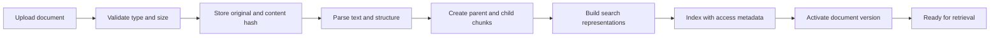
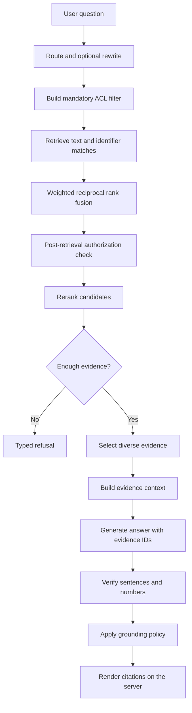
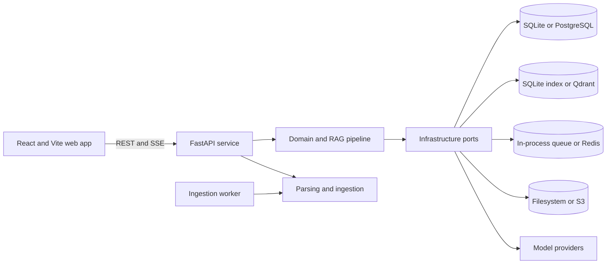

# SeismoBrain

SeismoBrain is a self-hosted, multi-user retrieval-augmented generation (RAG) platform for technical documentation. It turns uploaded documents into a searchable knowledge base and answers questions with server-rendered citations. If the available documents do not support an answer, the system returns a typed refusal instead of presenting an unsupported response.

Built by [Sri Yanto Qodarbaskoro](https://www.linkedin.com/in/sqodarbaskoro/) at [SeismoPilot](https://www.seismopilot.com) and released under the [MIT License](LICENSE).

> **Project status: pre-1.0 (`0.1.0`)**
>
> The architecture, access controls, grounding pipeline, and evaluation framework are implemented. The Starter tier currently uses lightweight deterministic components for embeddings, reranking, and claim verification. Review [Implementation status](#implementation-status) before evaluating retrieval or answer quality.

## Table of contents

- [What SeismoBrain provides](#what-seismobrain-provides)
- [Quick start](#quick-start)
- [How the RAG system works](#how-the-rag-system-works)
- [Architecture](#architecture)
- [Implementation status](#implementation-status)
- [Configuration](#configuration)
- [Deployment options](#deployment-options)
- [Development](#development)
- [Security](#security)
- [Troubleshooting](#troubleshooting)
- [Repository structure](#repository-structure)
- [Documentation](#documentation)
- [Contributing and license](#contributing-and-license)

## What SeismoBrain provides

- **Evidence-grounded answers:** The language model references evidence IDs. The server converts those IDs into document, section, and page citations.
- **Sentence-level verification:** Every generated sentence is checked against its cited evidence. Balanced mode labels unsupported content, while strict mode removes it.
- **Typed refusals:** The API distinguishes `no_evidence`, `insufficient_evidence`, `out_of_scope`, `policy_blocked`, and `provider_error` results.
- **Authorization-aware retrieval:** Every retrieval request requires a server-built access-control filter. A second authorization check runs after result fusion and before reranking.
- **Identifier-aware search:** Separate retrieval paths handle descriptive text and exact identifiers such as error codes, part numbers, and parameter names.
- **Structure-aware ingestion:** Documents are split at sentence boundaries into parent and child sections without silent text truncation.
- **Broad document support:** The ingestion pipeline accepts TXT, Markdown, PDF, DOCX, HTML, RTF, PPTX, XLSX, and ODT files.
- **Multiple model providers:** Supported transports include OpenAI-compatible endpoints, OpenRouter, local compatible servers, Anthropic, and Gemini.
- **Operational tooling:** The repository includes user and workspace management, audit logs, ingestion monitoring, evaluations, backup and restore commands, and deployment assets.
- **One codebase for multiple environments:** Starter, Team, Production, and air-gapped configurations use the same domain logic with different infrastructure adapters.

## Quick start

### Prerequisites

Install the following tools before cloning the repository:

- [Git](https://git-scm.com/)
- [Node.js](https://nodejs.org/) 22 or newer
- [Python](https://www.python.org/) 3.12 or newer
- [`uv`](https://docs.astral.sh/uv/)
- Access to a supported language model provider or compatible local endpoint

Docker is not required for the Starter tier.

> **Windows:** The Starter tier supports both [Git Bash](https://git-scm.com/downloads) (installed alongside Git for Windows) and PowerShell. WSL2 also works. Some manual configuration and Docker commands use POSIX shell syntax; PowerShell alternatives are provided under [Configuration](#configuration) and [Team tier with Docker Compose](#team-tier-with-docker-compose). Plain `cmd.exe` is not supported.

### 1. Clone the repository

```bash
git clone <repository-url>
cd seismobrain-pb
```

If you created a fork, replace the URL with your fork URL.

### 2. Install dependencies and create local configuration

```bash
npm run setup
```

The setup command:

1. Checks the Node.js and `uv` prerequisites.
2. Creates `.env` with random `JWT_SECRET` and `MASTER_KEY` values if the file does not exist.
3. Installs the Python and Node.js dependencies.
4. Creates the `data/` directory used by the Starter tier.

The first account registered in the browser becomes the system administrator. Complete that step before the service is reachable by anyone else.

Do not commit `.env` or the `data/` directory. The generated secrets protect sessions and stored provider credentials.

### 3. Start the Starter tier

```bash
npm run start:starter
```

The command builds the web application when necessary and starts the service at [http://127.0.0.1:8080](http://127.0.0.1:8080). Keep this terminal open while using SeismoBrain.

On Windows, run the same commands from Git Bash or PowerShell. If you cloned the repository or previously ran setup with an older version, run `npm run setup` once more before starting so all workspace dependencies are installed.

### 4. Complete the browser setup

1. Open `http://127.0.0.1:8080`.
2. Register the first account to complete the administrator bootstrap.
3. Open **Admin > Providers** and add a provider base URL, model name, and API key.
4. Test the provider connection.
5. Upload your own documents, or choose the sample documents option in the onboarding wizard.
6. Wait until the ingestion monitor reports that the documents are ready, then ask a question in chat.

### 5. Verify the installation

```bash
curl http://127.0.0.1:8080/health
curl http://127.0.0.1:8080/ready
npm run doctor
```

The service is ready to use when the health endpoints succeed and the uploaded documents have reached the ready state.

## How the RAG system works

Retrieval-augmented generation combines document retrieval with language model generation. Instead of asking a model to answer only from its training data, SeismoBrain first finds relevant passages in the documents a user is allowed to access. It then supplies those passages as evidence for the answer and validates the result before returning it.

### Ingestion pipeline



1. **Validation:** The service checks file type, magic bytes, and upload size. Invalid files are quarantined.
2. **Parsing:** Parsers extract text and available structural information such as sections, pages, and tables.
3. **Chunking:** Content is divided at sentence boundaries. Parent chunks retain broader section context, while child chunks provide focused retrieval units.
4. **Indexing:** Search representations and access-control metadata are stored together so authorization can be applied during retrieval.
5. **Version activation:** A new document version becomes searchable only after indexing and consistency checks complete.

### Query and answer pipeline



The main stages are:

1. **Query routing and rewriting:** The question is classified and may be rewritten for retrieval. Exact identifiers from the original question are preserved.
2. **Access filtering:** The server constructs a mandatory access-control list (ACL) filter. Retrieval fails closed when this filter is absent.
3. **Hybrid sparse retrieval:** One BM25 arm searches descriptive text and another focuses on identifiers. Weighted reciprocal rank fusion combines their ranked results.
4. **Authorization guard:** Candidate documents are checked again against the metadata store. This protects against stale index permissions.
5. **Reranking and gating:** Candidates are reranked, then an answerability gate decides whether the evidence is sufficient. Insufficient evidence produces a typed refusal.
6. **Evidence construction:** Diverse passages and relevant section context are assigned stable evidence IDs such as `E1` and `E2`.
7. **Grounded generation:** The provider receives the question and evidence context. It references evidence IDs rather than creating citation text.
8. **Verification:** Sentence tags, factual support, and numeric claims are checked before release.
9. **Citation rendering:** The server maps evidence IDs to trusted document metadata and stores an evidence snapshot for traceability.

This design separates retrieval, generation, verification, and citation rendering. That separation makes failures observable and prevents the model from authoring its own provenance.

## Architecture



The domain package does not import web frameworks, databases, or network clients. Infrastructure is supplied through adapters, which allows deployment tiers to share the same retrieval and grounding rules.

| Component | Location | Responsibility |
|---|---|---|
| API | `apps/api` | FastAPI routes, dependency wiring, Starter entry point, and web app hosting |
| Web | `apps/web` | React 19 and Vite browser application |
| Worker | `apps/worker` | Background ingestion for Team and Production tiers |
| Models | `apps/models` | Embedding, sparse encoding, reranking, and verification service |
| Core | `packages/core` | Retrieval, fusion, access guards, grounding, citations, and chunking |
| Adapters | `packages/adapters` | Database, vector store, queue, object store, and provider implementations |
| Ingestion | `packages/ingest` | Validation, parsing, versioning, activation, quarantine, and purge workflows |
| Contracts | `packages/contracts` | Shared API and domain contracts |
| Evaluation | `eval` | Golden datasets, calibration, security checks, and evaluation runner |
| Deployment | `deploy` | Docker Compose, Helm, proxy, and observability assets |

## Implementation status

The current code and the target design are intentionally documented separately. The Starter tier is suitable for local development and workflow testing, but its lightweight retrieval components should not be treated as a production quality benchmark.

| Area | Starter tier implementation |
|---|---|
| Retrieval | BM25 over an in-memory index persisted to SQLite, followed by authorization, reranking, generation, and verification |
| Dense embeddings | Deterministic SHA-256-derived, 32-dimensional vectors rather than a trained embedding model |
| Reranker and verifier | Lightweight lexical implementations |
| Parsing | `pypdf` for PDF and XML text extraction for DOCX, PPTX, XLSX, and ODT; no OCR or layout analysis |
| Vector database | Qdrant adapters exist, but the current Starter API path does not use them |
| Language model | A real provider or compatible local endpoint supplied by the operator |

Production deployments can replace the Starter tier's deterministic components through the existing adapters. Treat the table above as the current implementation status, not as a production quality benchmark.

## Configuration

`npm run setup` creates `.env` automatically. To configure it manually, copy the template and generate strong secrets:

```bash
cp .env.example .env
openssl rand -hex 32
openssl rand -hex 32
```

Add one generated value to `JWT_SECRET` and the other to `MASTER_KEY`.

**Windows (PowerShell):** PowerShell does not ship `cp` or `openssl`. Use:

```powershell
Copy-Item .env.example .env
node -e "console.log(require('crypto').randomBytes(32).toString('hex'))"
node -e "console.log(require('crypto').randomBytes(32).toString('hex'))"
```

Run each `node -e ...` command separately and copy its output into `JWT_SECRET` and `MASTER_KEY`. Git Bash ships with `openssl`, so the `bash` commands above work unmodified there.

| Variable | Default | Description |
|---|---|---|
| `JWT_SECRET` | Required | Signs authentication tokens |
| `MASTER_KEY` | Required | Encrypts stored provider credentials |
| `SB_TIER` | `starter` | Deployment tier: `starter`, `team`, or `production` |
| `ENVIRONMENT` | `development` | Runtime environment: `development`, `production`, or `test` |
| `REGISTRATION_MODE` | `approval` | Registration policy: `approval`, `closed`, or `open` |
| `BIND_HOST` | `127.0.0.1` | Interface used by the service |
| `PUBLIC_URL` | `http://127.0.0.1:8080` | Public service URL |
| `SB_DATA_DIR` | `data` | Starter databases, search index, objects, and queue lock |
| `ACCESS_TOKEN_TTL_MIN` | `15` | Access token lifetime in minutes |
| `REFRESH_TOKEN_TTL_DAYS` | `7` | Refresh token lifetime in days |
| `AUTH_RATE_LIMIT_PER_MIN` | `10` | Authentication requests allowed per minute |
| `CHAT_RATE_LIMIT_PER_MIN` | `30` | Chat requests allowed per minute |
| `UPLOAD_RATE_LIMIT_PER_HOUR` | `60` | Upload requests allowed per hour |
| `UPLOAD_MAX_BYTES` | `209715200` | Maximum upload size, equal to 200 MiB |
| `AIR_GAPPED` | `false` | Blocks outbound network access when enabled |

See [.env.example](.env.example) for the complete list of settings used by local development, tests, and other deployment tiers.

Provider API keys are entered through **Admin > Providers**. They are encrypted with `MASTER_KEY` before storage and are not configured as environment variables.

## Deployment options

| Tier | Intended use | Metadata | Search | Queue | Object storage | Start command |
|---|---|---|---|---|---|---|
| Starter | Local evaluation and development | SQLite | SQLite-backed index | In process | Local filesystem | `npm run start:starter` |
| Team | Shared single-host deployment | PostgreSQL | Qdrant | Redis and Dramatiq | Docker volume | `npm run docker:up` |
| Production | Orchestrated deployment | PostgreSQL | Qdrant | Redis and Dramatiq | S3-compatible storage | `npm run deploy:k8s` |

### Team tier with Docker Compose

Docker Compose references locally built `seismobrain/*` images and requires a PostgreSQL password secret.

```bash
mkdir -p deploy/secrets
openssl rand -hex 32 > deploy/secrets/pg_password
npm run docker:build
npm run docker:up
```

Keep `deploy/secrets/pg_password` private. The Team tier is served through the included proxy on port `8080` for HTTP and port `8443` for HTTPS.

**Windows (PowerShell):** PowerShell's `mkdir` does not accept `-p`, and `openssl` is not built in. Use:

```powershell
New-Item -ItemType Directory -Force -Path deploy/secrets | Out-Null
node -e "console.log(require('crypto').randomBytes(32).toString('hex'))" | Out-File -Encoding ascii -NoNewline deploy/secrets/pg_password
npm run docker:build
npm run docker:up
```

Docker Compose requires [Docker Desktop](https://www.docker.com/products/docker-desktop/) with the WSL2 backend enabled.

### Production tier

The Kubernetes deployment uses the Helm chart in `deploy/helm/seismobrain`:

```bash
npm run deploy:k8s
```

Review the [runbooks](docs/runbooks/) and [sizing guide](docs/operations/sizing.md) before deploying outside a local environment.

## Development

### Common commands

| Command | Purpose |
|---|---|
| `npm run setup` | Install dependencies and create local secrets |
| `npm run start:starter` | Start the local Starter tier |
| `npm run doctor` | Check prerequisites, configuration, and port availability |
| `npm run build` | Regenerate API types and build the web application |
| `npm run lint` | Run Python and JavaScript lint checks |
| `npm run typecheck` | Run Python and TypeScript type checks |
| `npm test` | Run the repository test suite |
| `npm run test:e2e` | Run Playwright end-to-end tests |
| `npm run eval` | Run the offline evaluation runner against the golden dataset |
| `npm run sample:load` | Run the ingestion pipeline over the sample corpus as an offline smoke test (does not load documents into a running server) |

Some adapter tests use Testcontainers and require a running Docker daemon.

The `backup`, `restore`, `upgrade`, `reindex`, `migrate:tier`, and `keys:rotate` scripts are scaffolding for the Team and Production workflows. They currently run smoke checks or print placeholders, and their consistency reports are not derived from real data. Do not rely on them to protect, migrate, or re-encrypt real data. The same applies to the values in `eval/results/release-gate.json`, which are fixed smoke targets rather than measured results.

## Security

Never commit `.env`, provider credentials, deployment secrets, runtime databases, uploaded documents, or logs. Use `.env.example` as the configuration template. Report suspected vulnerabilities privately as described in [CONTRIBUTING.md](CONTRIBUTING.md).

### API

Application routes are available under `/api/v1`. The committed OpenAPI schema is located at `openapi/openapi.json`.

Useful service checks:

```bash
curl http://127.0.0.1:8080/health
curl http://127.0.0.1:8080/ready
```

## Troubleshooting

| Problem | Resolution |
|---|---|
| `.env missing; run npm run setup first` | Run `npm run setup`. |
| `Node.js >= 22 required` | Install Node.js 22 or newer and rerun setup. |
| `uv` is not found | Install `uv`, confirm it is on your `PATH`, and rerun setup. |
| Port `8080` is already in use | Stop the process using the port. Run `npm run doctor` to confirm the conflict. |
| Starter reports a queue lock error | Only one process can use a given `SB_DATA_DIR`. Stop the other Starter process or configure a different data directory. |
| The web application is missing | Run `npm run build`, then restart the Starter tier. |
| `openapi-typescript` is not recognized (Windows) | The web workspace dependencies are missing. Run `npm run setup` (or `npm install`), then run `npm run start:starter` again. |
| Starter immediately reports `could not build SPA` (Windows) | Pull the latest changes, run `npm run setup`, and retry. The startup and setup scripts must invoke the Windows npm shim through Node. |
| Documents do not appear in search | Check the ingestion monitor and wait for the ready state. Review quarantined or failed jobs. |
| Chat returns a provider error | Add and test a provider in **Admin > Providers**. Confirm the endpoint, model name, credentials, and network access. |
| Chat returns an evidence refusal | Confirm the relevant documents are ready and accessible to the current user. Try a question whose terms appear in the documents. |
| Adapter tests fail | Start Docker if the failing tests use Testcontainers. |
| `uv` or `npm` is not recognized (Windows) | Restart your terminal after installing so the updated `PATH` loads, or reinstall using the [official installer](https://docs.astral.sh/uv/getting-started/installation/) and select "Add to PATH". |
| Scripts fail with `mkdir: cannot create` or similar shell errors (Windows) | Run the guide's `bash` commands in Git Bash or WSL2, or use the PowerShell alternatives in [Configuration](#configuration) and [Team tier with Docker Compose](#team-tier-with-docker-compose). |

## Repository structure

```text
apps/
  api/          FastAPI service and Starter entry point
  models/       Model service
  web/          React and Vite browser application
  worker/       Background ingestion worker
packages/
  adapters/     Infrastructure implementations
  contracts/    Shared contracts
  core/         Domain, retrieval, and grounding logic
  ingest/       Parsing and ingestion workflows
deploy/         Docker Compose, Helm, proxy, and observability
docs/           Operations guides and runbooks
eval/           Evaluation runner, datasets, calibrations, and results
openapi/        Committed OpenAPI schema
samples/        Example documents for local testing
scripts/        Setup, operations, testing, and deployment commands
```

## Documentation

- [Operations runbooks](docs/runbooks/)
- [Sizing guide](docs/operations/sizing.md)
- [Contributing guide](CONTRIBUTING.md)
- [Changelog](CHANGELOG.md)

## Contributing and license

Contributions are welcome. Read [CONTRIBUTING.md](CONTRIBUTING.md) before opening a change.

SeismoBrain is licensed under the [MIT License](LICENSE).
